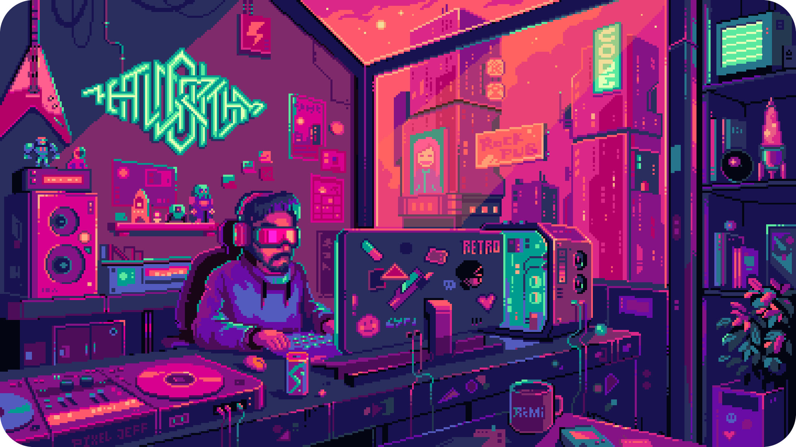

		

 

<strong>Hey 👋, I'm Sabeer Junaid 👨‍💻</strong>

 :dart: Front-End developer :heart: Open source contributor :e-mail: Ask me about anything: **sabeerjunaid992@gmail.com**  

<h2> 🥞 Tech Stack, 🎏 Socials,  Tools</h2>

	
 <a href="">
     
  </a>
  
<a href="sabeerjuniad.github.io/LinkNest">
     
  </a>

  <a href="">
     
  </a>
  
  

<h2>  Github Stats</h2>

    
    
  

<h2> 🏆 Github Trophy Showcase</h2>

  

	
### ✍️ Random Dev Quote
	

     

